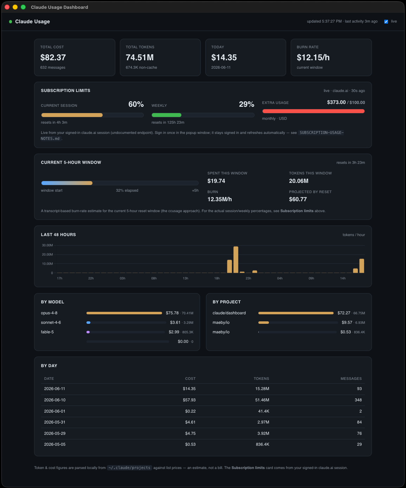

# Claude Usage Dashboard



A local **desktop app** (Electron) for keeping an eye on your Claude usage. It
pulls from two sources, both on your own machine:

1. **Claude Code usage** — parsed directly from the transcripts in
   `~/.claude/projects/**/*.jsonl`. Per-message token counts (input, output,
   cache write/read) are aggregated into cost estimates, broken down by model,
   project, and day, and grouped into the **5-hour reset windows** Claude uses,
   with a live burn-rate estimate. No API key, works offline.

2. **Live subscription limits** — the real **Current session %**, **Weekly %**,
   and **Extra usage $** that claude.ai shows for Pro/Max plans. There's no
   official API for these, so the app reads them from your **signed-in claude.ai
   session inside an embedded window** (see
   [How the live limits work](#how-the-live-limits-work)). Sign in once; it
   stays signed in.

The dashboard auto-refreshes every few seconds (local data) and polls the live
limits about once a minute.

## Requirements

- **Node.js ≥ 20.12** to build and run from source.
- **macOS** (built and tested here; the app packages to a `.dmg`). The live
  subscription-limits feature relies on a real Chromium window clearing
  Cloudflare, which Electron provides on any platform, but only macOS packaging
  is wired up in `package.json`.
- An existing Claude Code install with transcripts under `~/.claude/projects/`.
  If that folder is empty, the Claude Code panel simply shows no data.

## Run from source

```bash
cd claude-dashboard
npm install        # installs Electron + build tooling (no runtime deps)
npm start          # compiles, then launches the desktop app
```

On launch a **Sign in to Claude** window opens. Log into claude.ai there once
(and solve the Cloudflare check if it appears). The window then hides itself and
the dashboard populates — the live-limits card shows a "waiting for sign-in"
spinner until you're in.

## Build a distributable app

```bash
npm run dist:mac   # → release/Claude Usage Dashboard-<version>-<arch>.dmg
# or, faster, an unpacked .app without the DMG step:
npm run pack       # → release/mac-<arch>/Claude Usage Dashboard.app
```

> The build targets **your machine's architecture only** — on Apple Silicon it
> produces an `arm64` DMG that won't run on Intel Macs. For a universal (or Intel)
> build, add an `arch` to the `mac` block in `package.json`, e.g.
> `"mac": { "target": "dmg", "arch": ["arm64", "x64"] }`.

> The build is also **unsigned** (no Apple Developer ID). The first time you open
> the packaged app, macOS Gatekeeper will block it — **right-click the app → Open**
> to run it anyway. For a signed/notarized build, add an Apple Developer
> certificate and configure code signing in `package.json`.

## Configuration

**You don't need to configure anything.** A `.env` in the project root is loaded
automatically on launch if present; copy the template to start:

```bash
cp .env.example .env
```

| Variable        | Required? | Purpose                                                              |
| --------------- | --------- | -------------------------------------------------------------------- |
| `PORT`          | No        | Port the embedded dashboard server listens on. Default `3000`.       |
| `HOST`          | No        | Interface the embedded server binds to. Default `127.0.0.1`.         |
| `CLAUDE_ORG_ID` | No        | Override the auto-detected org UUID for the live-limits card. Not a secret. |

> ⚠️ **Never commit your real `.env`.** It's `.gitignore`d; only `.env.example`
> (which contains no secrets) belongs in the repo.

## How the live limits work

There is **no official API** for Pro/Max session/weekly limits, and claude.ai is
behind Cloudflare. A plain Node request to its usage endpoint gets a `403`
because Node's TLS/UA fingerprint isn't a real browser's. So the app does what a
real browser does — because it *is* one:

- An embedded Electron (real Chromium) window logs into claude.ai. You clear
  Cloudflare by hand once; the clearance cookie is bound to that window.
- The app then reads `GET /api/organizations/{org}/usage` **from inside that same
  window**, so the fingerprint and clearance match and the request succeeds.
- The result is normalized and served to the dashboard UI.

This is **undocumented and unsupported** — the endpoint can change or break
without notice. Details and the verified response shape are in
[`SUBSCRIPTION-USAGE-NOTES.md`](SUBSCRIPTION-USAGE-NOTES.md).

The transcript-based **5-hour window / burn-rate** card is separate and always
available offline. It replicates the approach of
[`ccusage`](https://github.com/ryoppippi/ccusage): group activity into 5-hour
windows mirroring Anthropic's reset cadence and project how fast you're burning
the current one. Costs are computed from public list prices and are
**estimates**, not a bill.

## How it works

TypeScript under `src/`, compiled to `dist/` by `npm run build`:

```
src/electron/main.ts   app entry: embedded claude.ai sign-in window, injects the
                       live-limits transport, then boots the local server + UI
src/server.ts          local HTTP server (127.0.0.1) + static file serving
  /api/usage           parses + aggregates local transcripts on each request
  /api/limits          live subscription limits from the poll cache
src/lib/parse.ts       reads ~/.claude transcripts, dedupes, per-file mtime cache
src/lib/pricing.ts     list prices per model + cost-per-record (incl. cache rates)
src/lib/aggregate.ts   totals, by-model/project/day, 5-hour blocks, burn rate, hourly series
src/lib/limits.ts      normalizes claude.ai usage; transport injected by the app
public/                dashboard UI (vanilla JS + Chart.js from CDN)
```

## Privacy & security

Everything runs locally. Your transcripts are read from `~/.claude/projects/` on
your own machine and never leave it — the app has no telemetry. The only outbound
requests are to Anthropic, with your own credentials: reads of your own claude.ai
usage endpoint from the signed-in window. No usage data is committed to the repo.

- **Localhost-only by default.** The embedded server binds to `127.0.0.1` and has
  **no authentication**. If you override `HOST` to `0.0.0.0`, anyone on your
  network can read your usage data.
- **Audit `.claude/settings.local.json` before committing anything like it.** If
  you use Claude Code in this repo, it writes per-machine permission grants there.
  That file is deliberately `.gitignore`d; review it occasionally and never
  force-add it to a public repo.

## License

[MIT](LICENSE) © 2026 woocyun

## Acknowledgments

- The 5-hour rolling-window burn-rate approach is inspired by
  [`ccusage`](https://github.com/ryoppippi/ccusage) (MIT).
- The trend chart uses [Chart.js](https://www.chartjs.org/) (MIT), loaded from a
  CDN at runtime.
